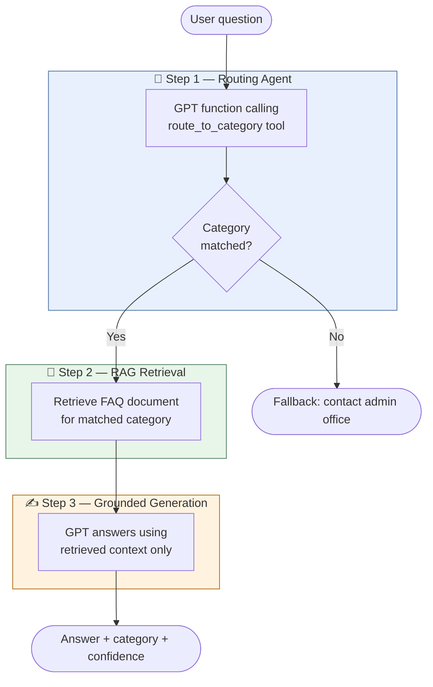

# 🧞 AdminGenie — Office Admin FAQ Chatbot

> A lightweight AI-powered assistant that answers administrative questions using
> a **Routing Agent + Retrieval-Augmented Generation (RAG)** pipeline,
> built with Azure OpenAI GPT and Streamlit.

**Author:** Su Myat Noe  
**Status:** Active development · v1.0

---

## Motivation

Administrative staff at research institutes and offices handle a high volume of
repetitive questions every day — about business trips, expense reimbursement,
leave applications, IT access, and facilities. These questions are time-consuming
to answer manually, yet the answers are well-documented in internal FAQs.

This project explores whether a practical LLM pipeline can:
- Automatically **understand the intent** of an admin question
- **Retrieve only the relevant** FAQ content for that question
- Generate a **grounded, accurate answer** — not a hallucination

Beyond automation, this project serves as a testbed for evaluating how well
current LLMs handle **real-world institutional FAQ tasks**.

---

## Objectives

1. **Build a working Agent + RAG pipeline** using Azure OpenAI function calling
   for intent routing and category-based document retrieval

2. **Demonstrate practical LLM deployment** — from local development on a remote
   GPU server to a browser-accessible Streamlit interface

3. **Create an extensible FAQ knowledge base** that non-technical staff
   (e.g. admin team, translators) can easily edit without touching code

4. **Establish a foundation** for future multilingual support (Japanese) and
   deployment as a Slack bot

5. **Showcase the project publicly** as a portfolio piece demonstrating
   end-to-end LLM application development

---

## System Architecture



| Step | What happens |
|------|-------------|
| **1. Agent** | GPT receives the question and calls `route_to_category` via function calling — returns structured JSON with `category`, `confidence`, and `reasoning` |
| **2. RAG** | The matched category fetches the corresponding FAQ document as grounding context |
| **3. Generate** | GPT answers using *only* the retrieved text — no hallucination beyond the FAQ |

---

## FAQ Categories

| Category | Topics |
|----------|--------|
| ✈️ Travel & Business Trip | Trip application, covered expenses, post-trip documents |
| 💴 Reimbursement & Expenses | Submission process, deadlines, lost receipts |
| 🌿 Leave & Absence | Annual leave, sick leave, parental leave |
| 💻 IT & Systems | GPU access, VPN, password reset, software |
| 🏢 Facilities & General Admin | Room booking, printing, access cards |

---

## Setup & Run

### Requirements
- Python 3.10+
- Azure OpenAI key with a GPT deployment

### Steps

```bash
# 1. Clone
git clone https://github.com/ImSuMyatNoe/adminbot.git
cd adminbot

# 2. Install
pip install -r requirements.txt

# 3. Set up your key
cp .env.example .env
# Open .env and fill in your Azure details

# 4. Run locally
streamlit run app.py

# On a remote server:
streamlit run app.py --server.port 8501 --server.address 0.0.0.0
```

### Environment variables (`.env`)
```
AZURE_OPENAI_KEY         = your key
AZURE_OPENAI_ENDPOINT    = https://your-resource.openai.azure.com/
AZURE_OPENAI_DEPLOYMENT  = your deployment name
AZURE_OPENAI_API_VERSION = 2025-04-01-preview
```

---

## Project Structure

```
adminbot/
├── app.py            ← main app: agent + RAG pipeline + Streamlit UI
├── categories.py     ← FAQ knowledge base (edit this to add content)
├── .env.example      ← key template (never commit .env)
├── .gitignore
├── requirements.txt
└── README.md
```

---

## Known Limitations & Areas for Improvement

| Area | Current limitation | Planned improvement |
|------|--------------------|---------------------|
| **Knowledge base** | Flat text in a Python file | Move to a vector database (FAISS) for larger document sets |
| **Language** | English only | Add Japanese Q&A (bilingual support) |
| **Retrieval** | Category-level retrieval (one doc per category) | Chunk-level retrieval for more precise answers |
| **Escalation** | Falls back to generic admin contact | Log unanswered questions → build a real escalation queue |
| **Evaluation** | No automated eval yet | Add answer quality metrics |
| **Model** | Azure GPT (cloud) | Swap to a locally-hosted model for privacy and cost |
| **Interface** | Streamlit web app | Deploy as Slack bot (see roadmap) |

---

## Roadmap

- [ ] Add Japanese FAQ content (bilingual support)
- [ ] Deploy as **Slack bot** on internal workspace channel
- [ ] Add escalation logging for unanswered questions
- [ ] Add chunk-level FAISS retrieval for larger FAQ sets
- [ ] Evaluate answer quality against a ground-truth FAQ dataset

---

## Why Slack? (Future Goal)

The end goal is to deploy AdminGenie directly inside an office Slack workspace —
so staff can ask admin questions without leaving their existing workflow.

When a question cannot be answered, the bot will automatically
**escalate to the admin team** via a dedicated Slack channel,
creating a smooth human-in-the-loop handoff.

---

## Author

**Su Myat Noe**  
[imsumyatnoe.github.io](https://imsumyatnoe.github.io)

---

## License

This project is licensed under the [MIT License](LICENSE) — feel free to use,
modify, and share with attribution.